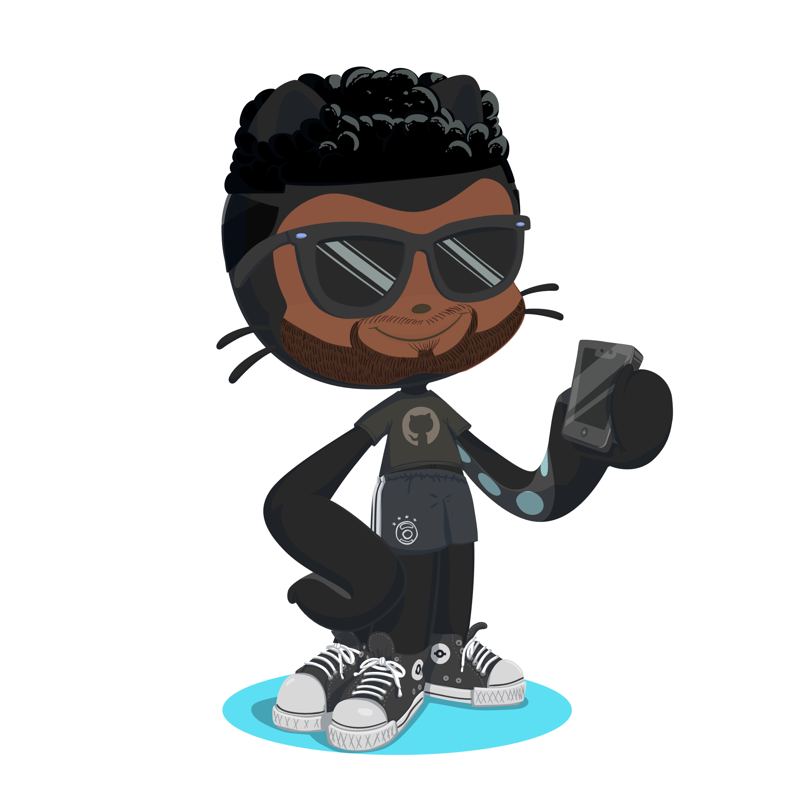

<!DOCTYPE html>
<html lang="pt-BR">
<head>
  <meta charset="UTF-8">
  <meta name="viewport" content="width=device-width, initial-scale=1.0">
  <title>App Mobile</title>
  
</head>
<body>
  

    <h1 align="center">App Mobile</h1>

    

      Aula exclusiva da trilha React Native da Rocketseat  
      <a href="https://app.rocketseat.com.br/classroom/projeto-01">Estude esse projeto em formato de vídeo clicando aqui.</a>
    

    

      <a href="#-tecnologias">Tecnologias</a>&nbsp;&nbsp;&nbsp;|&nbsp;&nbsp;&nbsp;
      <a href="#-projeto">Projeto</a>&nbsp;&nbsp;&nbsp;|&nbsp;&nbsp;&nbsp;
      <a href="#-layout">Layout</a>&nbsp;&nbsp;&nbsp;|&nbsp;&nbsp;&nbsp;
      <a href="#memo-licença">Licença</a>
    

    

      
    

     

    

      
    

    ## 🚀 Tecnologias

    Esse projeto foi desenvolvido com as seguintes tecnologias:

    - React Native
    - TypeScript
    - Git e Github
    - Expo

    ## 💻 Projeto

    O DevLinks é um agregador de links para usar como cartão de visitas online.

    - [Acesse o projeto finalizado, online](https://tonfabian.github.io/projeto/)
    - [Assistir aulas](https://app.rocketseat.com.br/classroom/projeto-01)

    # Minhas Redes Sociais

    

      <a href="https://www.facebook.com/werton.fabian/">📘</a>
      <a href="https://www.instagram.com/werton_fabian/">📸</a>
      <a href="www.linkedin.com/in/werton-fabian-7ba5282aa">🔗</a>
    

    ## :memo: Licença

    Esse projeto está sob a licença MIT.

    ---

    Feito com ♥ by Rocketseat :wave: [Participe da nossa comunidade!](https://discord.gg/rocketseat)
  

</body>
</html>
