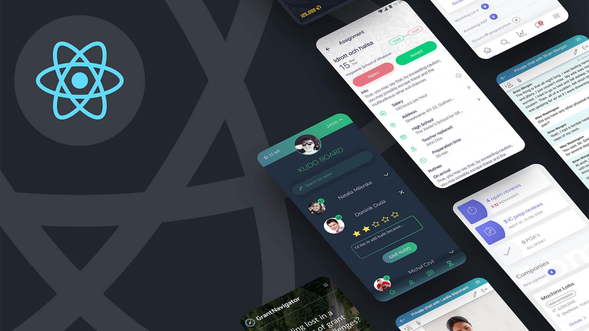

# App Mobile

Aula exclusiva da trilha React Native da Rocketseat. Estude esse projeto em formato de vídeo clicando [aqui](https://app.rocketseat.com.br/classroom/projeto-01).

## 🚀 Tecnologias

Esse projeto foi desenvolvido com as seguintes tecnologias:

- React Native
- TypeScript
- Git e Github
- Expo

## 💻 Projeto

O DevLinks é um agregador de links para usar como cartão de visitas online.

- [Acesse outros projetos, online](https://github.com/TonFabian)
- [Assistir aulas](https://app.rocketseat.com.br/classroom/projeto-01)

# Minhas Redes Sociais

Você pode me encontrar nas seguintes redes sociais:

 

## :memo: Licença

Esse projeto está sob a licença MIT.

---

Feito com ♥ by Rocketseat :wave: [Participe da nossa comunidade!](https://discord.gg/rocketseat)
